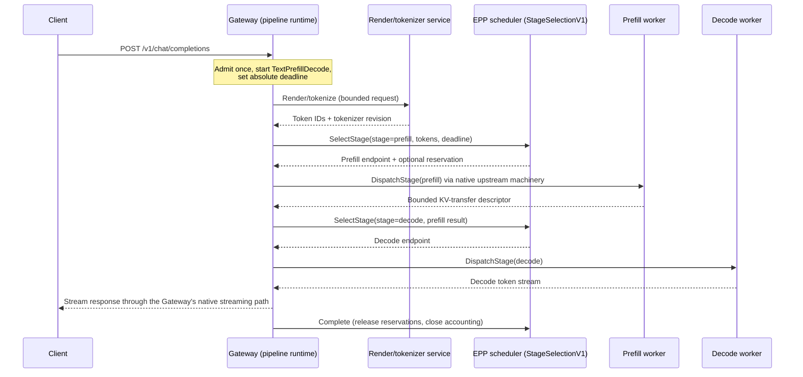

# Gateway-owned inference pipelines

**Authors**: Maksim Khadkevich (_NVIDIA_)

**Terminology**: _Gateway_ refers to the llm-d Router's Proxy — the Gateway API data
plane that terminates client traffic. _EPP_ is the llm-d Endpoint Picker. _Coordinator_
refers to the orchestration service that began in `llm-d-incubation/coordinator` and
was consolidated into `llm-d/llm-d-router` in July 2026
([llm-d-router#1872](https://github.com/llm-d/llm-d-router/pull/1872)).

## Summary

This proposal defines a small set of typed inference pipelines and makes their
semantics independent of the process that executes them. A pipeline may run in a
capable Gateway, an external Coordinator, or another conformant runtime.

The proposed additional runtime for capable providers is **gateway-owned
orchestration**: the Gateway that already owns the client stream also owns the bounded
request state machine. It calls render, scheduling, prefill, decode, and multimodal executors as
needed, dispatches through configured Gateway backends, and streams the final response
directly to the client.

This does not mean placing every component in the Gateway process. A stage may be
implemented as:

- A statically linked function.
- A dynamically loaded module.
- A sidecar or local Unix-domain-socket service.
- A versioned protocol call to another process.
- A dedicated network service.

All placements implement the same typed stage contract. Operators choose placement
based on latency, trust, isolation, portability, and provider capability.

The proposal is intentionally **not** a general workflow engine. Clients cannot submit
graphs, code, loops, or destinations. llm-d defines a small set of operator-installed,
versioned profiles with bounded stages and resources. The initial implemented profile
is text-only prefill/decode (P/D); simple aggregated inference is specified as the
definitional baseline and remains served by the existing Proxy/EPP path. The first
multimodal follow-up profile is `VisionLanguagePrefillDecode`, with explicit media and
encoder boundaries.

The existing [Coordinator proposal](coordinator.md) and its ongoing design work remain
valid. The Coordinator is the portable runtime when a Gateway cannot host
orchestration, stronger process isolation is desired, or application behavior changes
independently of Gateway release cycles. This proposal makes it one runtime for a
common contract rather than the only definition of the architecture. What is requested
here is approval to incubate the contract and an opt-in gateway-owned prototype — not
a migration of the default production topology.

Regardless of placement, any runtime that relays the client stream must enforce the
same connection-lifetime, backpressure, overload, drain, and accounting guarantees.
Placement changes where those guarantees live, not whether they are required.

## Motivation

The [llm-d Router](https://github.com/llm-d/llm-d/blob/main/docs/architecture/core/router/README.md)
combines a production Proxy with the llm-d Endpoint Picker (EPP). The
[Proxy](https://github.com/llm-d/llm-d/blob/main/docs/architecture/core/router/proxy.md)
accepts and streams requests; EPP applies inference-aware scheduling.

For an ordinary request, the Proxy parks the HTTP stream, consults EPP through the
Gateway API Inference Extension's ext-proc protocol, and forwards that stream to the
selected endpoint. This is a good fit for one request and one backend.

P/D and multimodal inference add a request-level state machine:

```text
validate -> preprocess -> select -> prefill/aggregate -> decode -> stream
```

That state machine needs one lifecycle owner. The owner decides what happens when the
client disconnects, a stage times out, an endpoint drains, output has already started,
or a reservation must be released.

An external Coordinator can own the lifecycle, as currently described in the
[Coordinator design discussion](https://docs.google.com/document/d/1Bdwdyh5ULnV_0bYMXlW2Em4BJISqqAJ9kjb9F3dv3vQ/edit):

```text
Client -> Coordinator -> Gateway/EPP -> workers -> Gateway -> Coordinator -> Client
```

This is portable and provides an independent failure domain. Its tradeoff is divided
traffic ownership: the Coordinator relays the final stream and must implement or
delegate backpressure, cancellation, overload, stage dispatch, drain, accounting, and
observability that the Proxy already provides.

A capable Gateway can instead own it:

```text
Client -> Gateway
            |-> external or local preprocessing
            |-> scheduler
            |-> selected inference stages
            `-> final response stream
```

The main benefit is not only fewer hops. It is one owner for the downstream connection,
absolute deadline, cancellation tree, admission, dispatch policy, and final accounting.
The Gateway can reuse its native connection pools, health checks, circuit breakers,
outlier detection, retries, overload protection, tracing, and graceful drain.

At a glance, the two placements trade off differently:

| Dimension | External Coordinator | Gateway-owned (proposed) |
| --- | --- | --- |
| Traffic ownership | Divided — relays the client stream and reimplements or delegates stream lifecycle | Unified — one owner for the downstream connection, deadline, and cancellation |
| Failure domain | Independent process; strongest isolation | Shared with the Gateway process; opt-in, off by default |
| Network path | Extra front-door service and stream relay | Direct dispatch through the Gateway's own upstreams |
| Traffic-management reuse | Must reimplement or delegate backpressure, retries, drain, accounting | Reuses native connection pools, circuit breakers, outlier detection, tracing |

Neither column is strictly better. The Coordinator's independent failure domain is a
real advantage, which is why it remains a supported runtime.

The architecture must still be portable. Gateway providers expose different extension
mechanisms, and some managed Gateways expose none. Therefore the proposal standardizes
behavior and contracts, not one ABI or process layout.

### Prior art

The gap this proposal addresses has been independently reported and worked around in
several projects:

- [llm-d Router issue #896](https://github.com/llm-d/llm-d-router/issues/896#issuecomment-4340493192)
  documents that a prefill request created by the P/D sidecar bypasses Envoy, so EPP
  cannot observe its request or response.
- [AIBrix issue #1223](https://github.com/vllm-project/aibrix/issues/1223) proposed
  P/D orchestration associated with Envoy. Its merged
  [implementation](https://github.com/vllm-project/aibrix/pull/1309) performs a direct
  prefill call inside the external processor before returning the decode endpoint to
  Envoy.
- [Envoy AI Gateway issue #769](https://github.com/envoyproxy/ai-gateway/issues/769)
  proposed a similar prefill-then-decode flow.

These efforts demonstrate the demand. They also show the failure mode when no gateway
stage-dispatch interface exists: the external processor grows its own HTTP client and
becomes a small, unmanaged Coordinator. The current llm-d direction addresses the same
gap by moving orchestration above EPP into the Coordinator; this proposal addresses it
by making selection and dispatch callable capabilities of the pipeline runtime.

### Why current EPP invocation is insufficient

The current
[Endpoint Picker Protocol](https://gateway-api-inference-extension.sigs.k8s.io/guides/implementers/)
is attached to an HTTP stream already traversing a Gateway route. ext-proc observes that
stream and returns the destination for the same stream.

An internal prefill request created by a gateway-owned state machine is not
automatically on the original listener or ext-proc filter path. Sending it back through
a listener adds recursive routing and can repeat policy, admission, tracing, and
accounting.

The missing interface is a scheduler API independent of a pre-existing HTTP stream.
It should reuse EPP's scheduler core while retaining ext-proc as the default adapter for
ordinary requests.

### Goals

- Make pipeline semantics independent of runtime placement.
- Let capable Gateways own bounded aggregated, text P/D, and later multimodal profiles.
- Preserve the Coordinator as a portable and conformant runtime.
- Reuse EPP scheduling through a transport-neutral stage-selection interface.
- Keep heavy and untrusted processing outside the Gateway by default.
- Support in-process, module, sidecar, protocol, and remote-service stage bindings.
- Preserve native Gateway traffic management for every dispatched stage.
- Define deadlines, cancellation, reservations, cleanup, telemetry, and accounting.
- Incubate experimental APIs with a path to the Gateway API Inference Extension.

### Non-Goals

- Removing or deprecating the Coordinator, EPP/ext-proc, or the routing sidecar.
- Requiring every Gateway implementation to support orchestration.
- Defining arbitrary DAGs, request-defined stages, loops, or tenant code.
- Running tokenizers, media codecs, inference engines, or KV movement in the Gateway by
  default.
- Standardizing one extension ABI across Envoy, agentgateway, Istio, kgateway, and
  managed providers.
- Claiming that gateway-owned placement is always faster or safer.

## Proposal

Define a versioned **Inference Pipeline Contract** with multiple runtimes:

```text
                         Inference Pipeline Contract
                                   |
             +---------------------+---------------------+
             |                     |                     |
    Gateway-owned runtime   External Coordinator    Routing sidecar
    optimized placement     portable placement      current compatibility
```

The Gateway may act as the request-lifecycle authority when it supports the selected
profile. Components remain independently placeable. The Coordinator provides the same
logical behavior when the capability is absent or isolation is preferred. Whether
gateway-owned placement should become a recommended default is decided only after the
conformance and benchmark evaluation described below.

Consistent with the project principle of respecting upstreams, the contract and APIs
incubate in llm-d as experimental, are designed against the upstream Gateway API
Inference Extension scheduler framework, and are proposed upstream once their semantics
stabilize.

### User Stories

#### Gateway-native text P/D

As an inference platform administrator, I can attach a supported text P/D pipeline to
an inference route. A capable Gateway executes the pipeline without a standalone
Coordinator, while tokenization and model execution remain in external services and
workers.

#### Portable Coordinator fallback

As an inference platform administrator, I can run the same pipeline through the
standalone Coordinator when my Gateway does not implement the pipeline runtime or when
I prefer its process-isolation boundary. Worker behavior and scheduling policy do not
change.

#### Pluggable endpoint selection

As a scheduler developer, I can expose the same selection behavior through the existing
ext-proc adapter, a local stage-selection service, or a safe linked adapter. The
pipeline does not depend on which transport or process placement is selected.

### Proposed decision

Approve the contract and API exploration, not a mandatory runtime migration:

- Incubate bounded `Aggregated`, `TextPrefillDecode`, and a later
  `VisionLanguagePrefillDecode` profile.
- Prototype `GatewayOwned` as opt-in while retaining Coordinator and sidecar runtimes.
- Specify StageSelectionV1 and adapt the existing EPP scheduler core to it.
- Evaluate all runtimes with common conformance and production benchmarks before
  recommending a default.

## Design Details

### Profiles, not arbitrary pipelines

llm-d defines and versions pipeline profiles. Each profile is a finite, acyclic state
machine compiled before traffic is accepted.

A profile specifies:

- Allowed stages and transitions.
- Typed, size-limited stage inputs and outputs.
- Absolute and per-stage deadlines.
- Retry and fallback classes.
- Cancellation and cleanup behavior.
- Required Gateway and executor capabilities.
- Telemetry and exactly-once accounting events.

The following are prohibited:

- Client-defined graphs, code, URLs, or plugins.
- Unbounded loops or fan-out.
- Arbitrary cross-namespace calls.
- Unbounded request context or stage responses.
- Dynamic stages not known to the profile version.

Limited conditionals are profile-defined. For example, text P/D may choose aggregated
decode when the selected decode worker already has sufficient prefix state.

### Flexible component binding

Logical components do not imply Kubernetes Deployments. The same stage contract may be
bound differently by provider or deployment:

| Binding | Typical use | Tradeoff |
| --- | --- | --- |
| Static link | Small trusted transforms or scheduler library | Lowest call overhead; shared failure domain |
| Dynamic module | Provider extension distributed separately | Native dispatch; ABI and crash coupling |
| Sidecar or UDS | Local isolation with low network cost | Extra process and lifecycle coordination |
| Versioned protocol | Portable local or remote implementation | Serialization and compatibility cost |
| Dedicated service | Heavy, untrusted, or independently scaled work | Strong isolation; network hop |

The contract, bounds, cancellation, and telemetry are identical across bindings. Heavy
tokenization, media processing, encode, prefill, decode, and KV movement are expected to
use sidecar or service placement unless a provider proves safe in-process execution.

### Gateway-owned responsibilities

The Gateway runtime owns only traffic lifecycle and bounded orchestration:

- Downstream stream, admission, absolute deadline, and cancellation.
- Profile state transitions and small request transformations.
- Calls to configured stage bindings.
- Mapping selections to operator-authorized Gateway backends.
- Native dispatch and final response streaming.
- One trace and accounting identity.

It does not own model computation or large data movement. Large media, embeddings, and
KV data move directly between executors; the Gateway carries handles and bounded
descriptors.

### Request walkthrough: text P/D

One text P/D request through the gateway-owned runtime:



Unified lifecycle ownership simplifies failure handling. For example, if the client
disconnects during prefill:

- The Gateway observes the downstream reset directly — there is no second traffic
  runtime whose view must be reconciled.
- The prefill worker may already hold allocated KV state.
- EPP may have in-flight accounting tied to the stage.
- A reservation may need release.

The pipeline runtime makes one terminal decision and performs idempotent cleanup: it
cancels the prefill dispatch through native upstream cancellation, emits `Release` to
the scheduler, and closes the single trace and accounting identity. When ownership is
divided between an edge Gateway and a relaying Coordinator, the same event produces two
observations of cancellation that must be reconciled across a service boundary.

### StageSelectionV1

Introduce a versioned selection interface independent of ext-proc. A request contains:

- Request identity, stage, model, and absolute deadline.
- Exact token IDs, prefix digest, or declared estimate mode.
- Candidate `InferencePool` references.
- Bounded state needed by the policy.
- Attempt and reservation requirements.

A response contains:

- Selection identity and selected pool/endpoint or Gateway-local backend key.
- Policy metadata and typed failure class.
- Optional reservation lease.

Lifecycle events include `CommitDispatch`, `Complete`, and `Release`. These preserve EPP
in-flight tracking, flow control, accounting, and reservations when no ext-proc stream
exists.

One scheduler core supports two adapters:

```text
                      EPP scheduler core
              filters -> scorers -> picker
                      /             \
           ext-proc adapter     StageSelectionV1
           routed streams       pipeline runtimes
```

The scheduler may return an entire P/D plan once or select later stages just in time.
Per-stage just-in-time selection is the default, because a decode endpoint chosen
before a long prefill can become stale and cannot incorporate the prefill result,
transfer descriptor, or retry exclusions. Plan-at-once remains available for policies
that prefer it. Request admission runs once even when selection runs more than once.

### Gateway dispatch

The required host operation is conceptually:

```text
DispatchStage(stage, backendKey, headers, boundedBody, deadline)
```

`backendKey` resolves only to operator-configured backends. Dispatch uses native health,
TLS, connection pooling, circuit breakers, outlier handling, retry budgets, tracing,
and drain. A scheduler cannot return an arbitrary URL that bypasses Gateway policy.

The final inference stage rejoins the normal router and streaming path. Intermediate
responses are bounded and consumed by the state machine.

### Kubernetes API

Incubate two experimental resources before proposing upstream APIs:

- `InferencePipeline`: attaches a profile and runtime policy to a route or
  `InferencePool`.
- `InferenceScheduler`: references StageSelectionV1 and declares capabilities and
  fallback policy.

An `InferencePipeline` selects a profile, attachment target, preferred runtime,
fallback, scheduler, and timeout. The exact attachment point is deliberately deferred
to API review.

The API separates portable intent from provider mechanics:

- **Portable resources.** `InferencePipeline` and `InferenceScheduler` carry the
  standard routing, profile, scheduler, and timeout intent.
- **Provider configuration.** Binding mechanics — module paths, static-link choices,
  local transports — stay out of the portable resources. Following the
  `GatewayClass.spec.parametersRef` precedent, `InferencePipeline` may carry an optional
  `parametersRef` that a provider resolves to a vendor resource, a `ConfigMap`, or
  nothing at all when the runtime is compiled in and configured natively.
- **Status.** The provider surfaces the selected runtime, active binding, and the
  `Accepted` / `ResolvedRefs` / `Programmed` conditions on `InferencePipeline`, so
  operators can see which mechanism is serving traffic without those mechanics becoming
  portable fields.

Providers report unsupported profiles or bindings explicitly. API review will decide
whether attachment targets `HTTPRoute`, `InferencePool`, or another Gateway API policy
point.

### Aggregated inference profile

The `Aggregated` profile is definitional, not a new runtime requirement:

```text
admit -> optional preprocess -> select -> dispatch -> stream
```

When no preprocessing is required, the existing Proxy/EPP path already implements this
profile efficiently and remains the recommended implementation. Nothing routes plain
aggregated requests through a Coordinator or a new pipeline runtime.

Specifying the profile still has value: it gives aggregated and disaggregated requests
one lifecycle vocabulary (admission, deadline, cancellation, accounting), and it covers
requests that need a bounded transform, external tokenization, or multimodal
preparation before ordinary dispatch.

### Text P/D profile

The initial implemented profile is:

```text
admit -> render/tokenize -> select/dispatch prefill
      -> collect KV descriptor -> select/dispatch decode -> stream
```

Tokenization policy is explicit:

- `worker`: no exact token-aware selection; the worker tokenizes once.
- `estimate`: approximate scheduling; the worker tokenizes exactly.
- `render-service`: exact tokens for scheduling; the worker may tokenize again.
- `tokens-in`: exact tokens are reused by scheduling and execution.

Model and tokenizer revision are part of the contract.

#### Decode continuation on migration (future capability)

Some inference frontends already migrate an in-progress decode to a healthy worker
while preserving the client stream — see NVIDIA Dynamo's
[request migration](https://github.com/ai-dynamo/dynamo/blob/main/docs/fault-tolerance/request-migration.md).
Because the pipeline runtime already owns and relays the decode stream, the contract is
designed to accommodate this as an optional, profile-declared capability rather than
regress it — the runtime can buffer emitted tokens and re-dispatch to a replacement
worker selected through StageSelectionV1. The mechanism, and its harder sub-problems
(sampling-state continuity, logprobs, and stop sequences across the migration boundary),
are deferred to a follow-up; this proposal only reserves room for it in the contract.

### VisionLanguagePrefillDecode profile (follow-up)

Multimodal inference adds media validation, retrieval, preprocessing, and optional
encoder execution. These operations are heavy and handle untrusted input, so they are
external by default. The boundary principle is fixed: the Gateway carries only bounded
metadata — content hashes, placeholder/token alignment, content-addressed object and
embedding handles, and encoder-cache descriptors — while media bytes and embeddings
move directly between executors.

`VisionLanguagePrefillDecode`, the first multimodal profile, is a follow-up proposal
and is not part of the decision requested here. The follow-up will define the stage graph, resource limits (item count, encoded
and decoded media size, redirects, retrieval time, and stage concurrency), fail-closed
behavior for required media, and egress/SSRF policy for media fetchers.

### Reliability and security

All runtimes enforce bounded concurrency, queues, request/context sizes, deadlines,
retries, and stage responses. Cancellation reaches callouts, dispatches, and
reservations; cleanup and drain are deterministic. Destinations and cross-namespace
references are operator-authorized. Sensitive data is redacted, with one trace and
exactly-once request accounting.

In-process threads protect an event loop from blocking but not from CPU saturation,
deadlock, allocator pressure, or OOM. Placement policy must account for the shared
failure domain.

### Risks and mitigations

- **Shared failure domain.** A defect in the pipeline runtime shares the Gateway
  process with all cluster ingress traffic. Mitigations: the runtime is opt-in and off
  by default; profiles are finite and compiled before traffic; heavy and untrusted
  work stays external; overload shedding, bounds, and a per-route kill switch are part
  of the contract; fault-injection conformance is gating.
- **Provider semantic divergence.** Independent Gateway implementations may drift.
  Mitigations: behavior conformance (not a shared ABI) is the graduation requirement;
  profiles are versioned; providers advertise supported profile versions explicitly.
- **Split-brain scheduler state.** Two adapters (ext-proc and StageSelectionV1) over
  one EPP core could desynchronize in-flight tracking and flow control. Mitigations:
  both adapters share one scheduler core and one in-flight/accounting state; the
  `CommitDispatch`/`Complete`/`Release` lifecycle exists precisely to keep
  reservation and flow-control state correct without an ext-proc stream.
- **Upstream acceptance.** The Gateway API Inference Extension may reshape or reject
  StageSelectionV1. Mitigations: the interface is designed against the upstream
  scheduler framework, incubates as experimental in llm-d, and ext-proc remains the
  default adapter throughout; nothing breaks if upstreaming is slow.
- **Scope creep toward a workflow engine.** Mitigation: the prohibited list above is
  part of the contract; new stages or transitions require a new profile version
  through proposal review.

### Coordinator runtime

The Coordinator remains a good choice when:

- The Gateway has no suitable extension or dynamic-dispatch capability.
- Independent process isolation is more important than the extra boundary.
- A managed Gateway cannot run custom code.
- Pipeline logic changes faster than Gateway rollout policy allows.
- The workflow intentionally contains application behavior outside the shared Gateway.

Its tradeoffs are the additional request/stream relay and the need to define how
admission, cancellation, traffic policy, retries, drain, tracing, and accounting are
divided with the Gateway. A mature Coordinator can address these; the common contract
lets it do so without creating different pipeline semantics. The Coordinator recently
consolidated from incubation into `llm-d/llm-d-router`
([llm-d-router#1872](https://github.com/llm-d/llm-d-router/pull/1872), see
[coordinator architecture](https://github.com/llm-d/llm-d-router/blob/main/docs/coordinator_architecture.md)),
and its design is still evolving — see the [Coordinator
Design](https://docs.google.com/document/d/1Bdwdyh5ULnV_0bYMXlW2Em4BJISqqAJ9kjb9F3dv3vQ/edit)
discussion. Agreeing on a placement-neutral contract now, while both the Coordinator
and gateway extension mechanisms are maturing, is cheaper than converging divergent
semantics later.

### Gateway-provider compatibility

Providers implement behavior, not a prescribed process layout. A conformant provider
advertises supported profile versions, bindings, asynchronous callouts, dynamic backend
selection, cancellation, bounds, and final streaming.

This supports native agentgateway code, Envoy extensions, Istio or kgateway extension
mechanisms, sidecars, and external adapters for managed Gateways.

### Implementation and success criteria

Feasibility is not in question, and the integration cost is small. The
[contract and a runnable reference](https://github.com/hutm/gateway-owned-inference-pipeline)
show the bounded text P/D state machine, `StageSelectionV1`, and the draft resources in
one small, readable place. The same state machine has additionally been prototyped end
to end in two production gateways with a deliberately minimal, additive footprint:

- [Envoy](https://github.com/hutm/envoy-pd-orchestration): **zero Envoy source changes**;
  the orchestration is a loadable dynamic module against stock Envoy.
- [agentgateway](https://github.com/hutm/agentgateway/pull/1): a purely additive change
  — **576 insertions, zero deletions** — with all logic in two new files plus ~35 lines
  of wiring, since agentgateway has no dynamic-module ABI.

The work below is about agreeing on the contract, not proving it can be built.

1. Review pipeline, StageSelectionV1, dispatch, and lifecycle contracts.
2. Implement the contract in the Coordinator and an opt-in agentgateway runtime.
3. Add an EPP StageSelectionV1 adapter while preserving ext-proc.
4. Validate Envoy and other provider adapters with one conformance suite.
5. Evaluate real aggregated, P/D, and multimodal workloads.

Gateway-owned placement remains experimental until it explicitly proves:

- **Conformance parity:** matches Coordinator semantic and failure conformance.
- **Scheduling quality:** preserves EPP flow control and scheduling quality.
- **Bounded resources:** bounded Gateway CPU and memory under overload and slow clients.
- **Upgrade safety:** drains and upgrades without unacceptable request loss.
- **No leaks:** no accounting duplication or reservation leaks.
- **Real benefit:** a demonstrated production benefit for at least one provider/workload.

### Open questions

- **API attachment point.** Whether `InferencePipeline` attaches via `HTTPRoute`
  `ExtensionRef`, an `InferencePool` policy, or another Gateway API policy point is
  deferred to API review.
- **Home of StageSelectionV1.** Whether the protocol is proposed to the Gateway API
  Inference Extension immediately or after llm-d incubation, and which repository
  hosts the EPP adapter during incubation.
- **Reservation and lease semantics.** How leases interact with the upstream flow
  control work, what expiry defaults apply, and whether reservations are required or
  optional per profile.
- **Plan-at-once policies.** Which scheduling policies, if any, should return a full
  P/D plan in one selection call, and how staleness is bounded when they do.
- **Decode continuation protocol.** Whether the decode stage protocol carries token
  IDs by default or by capability negotiation, how the continuation buffer is
  bounded for long generations, and how sampling state, logprobs, and stop
  sequences behave across a migration boundary.

## Alternatives

- **Coordinator only:** portable and isolated, but always adds an application proxy and
  stream relay. It remains a supported runtime.
- **Routing sidecar:** proven and close to engine mutation, but does not give the Gateway
  complete lifecycle authority. It remains a compatibility runtime.
- **Orchestration inside ext-proc EPP:** mixes scheduling with long-lived orchestration,
  as the adjacent AIBrix implementation illustrates. StageSelectionV1 reuses EPP
  intelligence without assigning it lifecycle ownership.
- **Recursive Gateway routing:** reuses ext-proc but can repeat policy, admission,
  tracing, and accounting. It may be an adapter, not the contract.
- **All processing in the Gateway:** removes callouts but shares CPU, memory, and media
  failure domains. Heavy processing remains external by default.

## Release Notes

No immediate user-facing behavior changes. New APIs and gateway-owned profiles are
experimental, off by default, and require provider capability. Existing Coordinator,
EPP/ext-proc, aggregated routing, and routing-sidecar deployments continue unchanged.

## References

- [llm-d Router architecture](https://github.com/llm-d/llm-d/blob/main/docs/architecture/core/router/README.md)
- [llm-d Proxy architecture](https://github.com/llm-d/llm-d/blob/main/docs/architecture/core/router/proxy.md)
- [Coordinator proposal](coordinator.md)
- [Coordinator consolidation into llm-d-router (llm-d-router#1872)](https://github.com/llm-d/llm-d-router/pull/1872)
- [Coordinator architecture](https://github.com/llm-d/llm-d-router/blob/main/docs/coordinator_architecture.md)
- [Coordinator Design](https://docs.google.com/document/d/1Bdwdyh5ULnV_0bYMXlW2Em4BJISqqAJ9kjb9F3dv3vQ/edit)
- [llm-d Router issue #896](https://github.com/llm-d/llm-d-router/issues/896#issuecomment-4340493192)
- [AIBrix issue #1223](https://github.com/vllm-project/aibrix/issues/1223) and
  [implementation PR #1309](https://github.com/vllm-project/aibrix/pull/1309)
- [Envoy AI Gateway issue #769](https://github.com/envoyproxy/ai-gateway/issues/769)
- [Gateway API security and roles](https://gateway-api.sigs.k8s.io/docs/concepts/security/)
- [Inference Extension implementer guide](https://gateway-api-inference-extension.sigs.k8s.io/guides/implementers/)
- [Envoy overview](https://www.envoyproxy.io/docs/envoy/latest/intro/what_is_envoy)
- [Contract and reference sketch: StageSelectionV1, draft CRDs, runnable reference](https://github.com/hutm/gateway-owned-inference-pipeline)
- [Envoy integration POC (zero Envoy source changes)](https://github.com/hutm/envoy-pd-orchestration)
- [agentgateway integration POC (additive change, reviewable diff)](https://github.com/hutm/agentgateway/pull/1)
