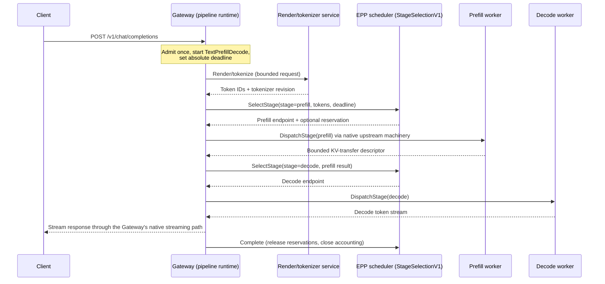

# Gateway-owned inference pipelines

**Authors**: Maksim Khadkevich (_NVIDIA_)

**Terminology**: _Gateway_ is the llm-d Router's Proxy — the Gateway API data plane that
terminates client traffic. _EPP_ is the llm-d Endpoint Picker. _Coordinator_ is the
orchestration service that began in `llm-d-incubation/coordinator` and consolidated into
`llm-d/llm-d-router` in July 2026
([llm-d-router#1872](https://github.com/llm-d/llm-d-router/pull/1872)). _Pipeline core_
is the small, shared request-shaping library introduced here.

## Summary

This proposal standardizes P/D and multimodal inference as a small set of typed
**inference pipelines** with two deliverables:

1. **A versioned contract** — `StageSelectionV1` plus bounded, typed request-shaping —
   whose semantics are independent of the process that executes them.
2. **A shared, verified core** — one small library that performs the pipeline's
   request-shaping (render → prefill → decode body construction). We have verified it
   produces **byte-for-byte identical** output to the llm-d Coordinator's own
   `buildPrefillBody`/`prepareDecodeBody`, and to independent Envoy and agentgateway
   implementations. It ships from one source in the forms each runtime can consume
   (Rust crate, C-ABI shared object, optionally Wasm).

The framing is deliberately **additive, not competitive**. The Coordinator is not
replaced; it is the **first reference implementation** of the contract and the direct
beneficiary of the shared core (it can drop a hand-maintained copy of the transform).
Gateways that can host orchestration — Envoy and agentgateway today — are **additional
conformant runtimes** for operators who want them, not a mandated topology.

A capable Gateway that hosts the pipeline owns the bounded request state machine
alongside the client stream: it calls render, scheduling, prefill, decode, and (later)
multimodal executors, dispatches through configured Gateway backends, and streams the
final response directly to the client. Heavy and untrusted work (tokenizers, media
codecs, inference engines, KV movement) stays external by default.

What is requested is approval to **incubate the contract and the shared core**, with an
opt-in gateway-owned prototype — not a migration of the default production topology.
Whether gateway-owned placement becomes a recommended default is decided only after the
conformance and benchmark evaluation described below.

## Motivation

The [llm-d Router](https://github.com/llm-d/llm-d/blob/main/docs/architecture/core/router/README.md)
combines a production Proxy with EPP. For an ordinary request the Proxy parks the HTTP
stream, consults EPP through the Inference Extension's ext-proc protocol, and forwards
the stream to the selected endpoint — a good fit for one request and one backend.

P/D and multimodal inference add a request-level state machine:

```text
validate -> preprocess -> select -> prefill/aggregate -> decode -> stream
```

That state machine needs one lifecycle owner — for client disconnect, stage timeout,
endpoint drain, output-already-started, and reservation release.

### Two problems, one of which is under-appreciated

**Problem 1 — lifecycle ownership.** Either an external Coordinator or a capable Gateway
can own it. That tradeoff is well understood (table below).

**Problem 2 — duplicated, unverified request-shaping.** The *transform* that turns a
client request into prefill/decode requests (inject token IDs, set `max_tokens=1` for
prefill, attach `kv_transfer_params`) is implemented **at least four times today** —
in the Coordinator, the routing sidecar, and each gateway prototype — with **no shared
conformance**. Small drift here (a key, a flag, a number) is a silent correctness bug
across runtimes. Nobody defends four copies of untested request-shaping; this is the
cheaper, less contentious half of the proposal, and it benefits the Coordinator first.

### Lifecycle placement tradeoff

An external Coordinator owns the lifecycle:

```text
Client -> Coordinator -> Gateway/EPP -> workers -> Gateway -> Coordinator -> Client
```

Portable, independent failure domain; tradeoff is divided traffic ownership. A capable
Gateway can own it instead, dispatching through its own upstreams and streaming directly.

| Dimension | External Coordinator | Gateway-owned (proposed, opt-in) |
| --- | --- | --- |
| Traffic ownership | Divided — relays the client stream, reimplements/delegates lifecycle | Unified — one owner for downstream connection, deadline, cancellation |
| Failure domain | Independent process; strongest isolation | Shared with the Gateway; opt-in, off by default |
| Network path | Extra front-door service + stream relay | Direct dispatch through the Gateway's upstreams |
| Traffic-management reuse | Must reimplement/delegate pooling, retries, drain, accounting | Reuses native pools, circuit breakers, outlier detection, tracing |

Neither column is strictly better. The Coordinator's independent failure domain is a
real advantage and it remains a supported runtime.

### What is actually "for free" — and what is not

The "reuse the Gateway's traffic management" benefit must be stated precisely, or it
overclaims. It splits in two:

- **Client-path features** — the downstream connection, the final SSE stream, and
  auth / rate-limit / mTLS / request-level deadline / cancellation / main-request
  observability applied to the *client* request. **Any in-path runtime inherits these**,
  on essentially any gateway, because the pipeline runs as a filter on that request.
- **Callout-path features** — connection pooling, LB across replicas, retries, circuit
  breaking, mTLS, per-upstream timeouts, and telemetry on the *render/prefill/select
  sub-calls*. **These are inherited only where the extension routes callouts through the
  Gateway's own upstream clusters** — Envoy dynamic modules / proxy-wasm, and
  agentgateway's client. On gateways without that capability, the sub-calls use a
  separate client and you re-implement egress — i.e. you regress toward the Coordinator.

So the gateway-owned advantage over the Coordinator is *specifically* callout-path reuse,
and it is real only on gateways whose extension model supports in-data-plane fan-out.
This proposal scopes the claim accordingly rather than implying it is universal.

### Prior art

- [llm-d Router #896](https://github.com/llm-d/llm-d-router/issues/896#issuecomment-4340493192):
  a P/D-sidecar prefill request bypasses Envoy, so EPP cannot observe it.
- [AIBrix #1223](https://github.com/vllm-project/aibrix/issues/1223) /
  [#1309](https://github.com/vllm-project/aibrix/pull/1309): P/D orchestration that
  performs a direct prefill call inside the external processor.
- [Envoy AI Gateway #769](https://github.com/envoyproxy/ai-gateway/issues/769): a
  similar prefill-then-decode flow.

These show the demand — and the failure mode when no gateway stage-dispatch interface
exists: the external processor grows its own HTTP client and becomes a small, unmanaged
Coordinator.

### The real gap: ext-proc is a filter, not a coordination interface

Every disaggregated architecture performs the same **logical steps** — validate the
request, optionally split it into sub-requests, select a worker for each, dispatch in
order, and stream/reconstruct the response. They differ only in *which component owns each
step*. The step with no standard interface today is **coordination**: selecting per stage
and fanning out to more than one worker.

ext-proc cannot do it. It is attached to an HTTP stream already traversing a route; its
entire action set is mutate-headers/body/trailers or send-an-immediate-response — **there
is no "call component X, get the result, and resume" action.** So an ext-proc processor
*cannot fan out through the Gateway*; to run render → prefill → decode it makes those calls
with its **own** client — exactly what the Coordinator does. For this pipeline, **ext-proc
and the Coordinator are the same architecture** (external orchestration, external egress),
differing only in wire protocol and whether the Gateway stays in-path as a filter.

Worse, ext-proc keeps EPP **in the byte path**. llm-d's EPP uses `FULL_DUPLEX_STREAMED`:
every response chunk round-trips Envoy→EPP→Envoy, and EPP parses each chunk (usage/latency
metrics, model-name rewrite) on the critical path. That is a filter, not a router.

The three known ways to overcome EPP's inability to coordinate differ only in *where*
coordination is placed:

- **llm-d**: a Coordinator in front calling EPP → coordination moves **left**.
- **on-ramp EPP**: a sidecar at the worker → coordination moves **right**.
- **gateway-owned (this proposal)**: coordination **in the Gateway**, via
  `StageSelectionV1` — a control-flow interface, not a filter.

So a new API is warranted, and it is a small one: not "let the Gateway own the connection"
but **"give EPP the coordination interface ext-proc structurally lacks, and keep EPP off
the byte path (selection-only)."** `StageSelectionV1` is that interface — a
stream-independent selection call reusing EPP's scheduler core.

### Relation to the Coordinator design options (A/B/C)

The original Coordinator design weighed three placements and recommended B; this proposal
adds a fourth and keeps that decision record explicit rather than dropping it:

| Option | Shape | Coordination | Gateway kept? | EPP on byte path? |
| --- | --- | --- | --- | --- |
| A (implemented) | Coordinator → Envoy+EPP → worker | left | yes | yes (filter) |
| B (recommended) | Coordinator → EPP direct; Envoy routes | left | yes | no (selection) |
| C | Coordinator+EPP, no Envoy | left | **no** (≈ Dynamo frontend) | fused |
| **D (this proposal)** | Gateway owns the pipeline; calls EPP via StageSelectionV1 | **in the Gateway** | yes | no (selection-only) |

D keeps the Gateway — the reason B and C retained it (mature networking, Gateway API
portability) — while giving it the coordination A/B lack at the EPP layer. It is additive
to the Coordinator, not a rejection of it.

### Goals

- Standardize a small, shared, **verified** request-shaping core across all runtimes.
- Make pipeline semantics independent of runtime placement.
- Let capable Gateways own bounded aggregated, text P/D, and later multimodal profiles.
- Preserve the Coordinator as a portable, conformant runtime **and a consumer of the core**.
- Reuse EPP scheduling through a transport-neutral stage-selection interface.
- Keep heavy and untrusted processing outside the Gateway by default.
- Support in-process, module, sidecar, protocol, and remote-service stage bindings.
- Preserve native Gateway traffic management for every dispatched stage where the
  provider's extension model allows it.
- Incubate experimental APIs with a path to the Gateway API Inference Extension.

### Non-Goals

- Removing or deprecating the Coordinator, EPP/ext-proc, or the routing sidecar.
- Requiring every Gateway to support orchestration, or claiming the "for free" callout
  reuse exists on every gateway.
- Defining arbitrary DAGs, request-defined stages, loops, or tenant code.
- Running tokenizers, media codecs, inference engines, or KV movement in the Gateway by
  default.
- Mandating a single extension ABI across Envoy, agentgateway, Istio, kgateway, and
  managed providers. (One shared *core*, many host bindings — see below.)
- Claiming gateway-owned placement is always faster or safer.

## Proposal

Define a versioned **Inference Pipeline Contract** with a **shared core** and multiple
runtimes:

```text
                Inference Pipeline Contract  +  shared pipeline core
                                   |
             +---------------------+---------------------+
             |                     |                     |
    External Coordinator   Gateway-owned runtime    Routing sidecar
    portable placement     optimized placement      current compatibility
    (reference impl #1)    (Envoy, agentgateway)    (compatibility)
```

The Coordinator provides the logical behavior for any gateway; capable Gateways provide
an optimized in-data-plane placement. All consume the same core and honor the same
contract. Consistent with respecting upstreams, the contract incubates in llm-d as
experimental, is designed against the upstream Inference Extension scheduler framework,
and is proposed upstream once semantics stabilize.

### The shared core: one source, many hosts, verified identical

The pipeline is two layers. Keeping them separate is what makes "universal" real:

- **Transform core** (`prefill_body`/`decode_body`): pure, stateless request-shaping.
  This is genuinely shareable. The only per-host variable is the value of
  `kv_transfer_params` — the KV-connector policy — which each host computes and passes
  in; the core does the JSON surgery.
- **Orchestration** (the render→select→prefill→select→decode fan-out): drives each
  host's own callout primitive, so it is a thin per-host adapter, not shared code.

The core ships from **one source** in three forms, so any runtime can consume it without
a common ABI mandate:

| Form | Consumers | Mechanism |
| --- | --- | --- |
| Rust crate | Rust hosts: Envoy dynamic module, agentgateway, Pingora-class proxies | compiled in, zero FFI |
| C-ABI shared object + header | Go Coordinator (cgo); LuaJIT gateways — Kong/APISIX/OpenResty — via `ffi.load`; NGINX C modules; Python `ctypes` | `dlopen`/link the `pd_*` symbols |
| Wasm module (optional) | proxy-wasm / http-wasm hosts (Envoy, Istio, APISIX, Kong, Traefik) | one sandboxed artifact |

**Verified conformance (the key de-risking fact).** A conformance test runs the
Coordinator's real `buildPrefillBody`/`prepareDecodeBody` and the shared core on the
same request context and asserts **byte-for-byte equality** for the shared-storage
chat-completions path; equivalent tests hold for the Envoy and agentgateway
implementations, over nested objects, unicode, floats, and extra keys. Adopting the core
therefore costs the Coordinator nothing behaviorally and removes a fourth copy of the
transform. (As a bonus, the Rust core is *faster* than a Go `map[string]any` marshal on
the same input.)

### User Stories

- **Gateway-native text P/D.** An administrator attaches a supported text P/D pipeline
  to an inference route; a capable Gateway executes it without a standalone Coordinator,
  while tokenization and model execution stay external.
- **Portable Coordinator fallback.** The same pipeline runs through the standalone
  Coordinator when the Gateway cannot host it or when process isolation is preferred;
  worker behavior and scheduling policy are unchanged, and the request-shaping is
  literally the same code.
- **Pluggable endpoint selection.** A scheduler developer exposes the same selection
  behavior through the ext-proc adapter, a local stage-selection service, or a linked
  adapter; the pipeline does not depend on transport or placement.

### Proposed decision

Approve the contract, the shared core, and API exploration — not a mandatory migration:

- Incubate the shared request-shaping core and its conformance suite.
- Incubate bounded `Aggregated`, `TextPrefillDecode`, and a later
  `VisionLanguagePrefillDecode` profile.
- Prototype `GatewayOwned` as opt-in while retaining Coordinator and sidecar runtimes.
- Specify `StageSelectionV1` and adapt the existing EPP scheduler core to it.
- Evaluate all runtimes with common conformance and production benchmarks before
  recommending a default.

## Design Details

### Profiles, not arbitrary pipelines

llm-d defines and versions pipeline profiles; each is a finite, acyclic state machine
compiled before traffic. A profile specifies allowed stages/transitions, typed
size-limited I/O, absolute and per-stage deadlines, retry/fallback classes, cancellation
and cleanup, required capabilities, and telemetry/accounting events. Prohibited:
client-defined graphs/code/URLs/plugins, unbounded loops or fan-out, arbitrary
cross-namespace calls, unbounded context, and dynamic stages unknown to the profile
version. Limited conditionals are profile-defined (e.g. aggregated decode when the
decode worker already holds sufficient prefix state).

Bounded profiles are a deliberate trade-off, not a limitation to apologize for. A
Coordinator can compose arbitrary plugin steps (concurrency, parallelism); a
gateway-hosted runtime in a shared failure domain must not. Flexibility comes from
**versioned profiles through review** plus **profile-declared conditionals and
properties** (e.g. the P/D execution model below) — bounded, conformance-testable
flexibility. Free composition remains available via the Coordinator runtime.

### Flexible component binding

Logical components do not imply Kubernetes Deployments; the same stage contract binds
differently by provider:

| Binding | Typical use | Tradeoff |
| --- | --- | --- |
| Static link / crate | Small trusted transforms, scheduler library, the shared core | Lowest overhead; shared failure domain |
| Dynamic module / C-ABI `.so` | Provider extension distributed separately | Native dispatch; ABI and crash coupling |
| Sidecar or UDS | Local isolation, low network cost | Extra process and lifecycle |
| Versioned protocol | Portable local or remote implementation | Serialization/compat cost |
| Dedicated service | Heavy, untrusted, independently scaled work | Strong isolation; network hop |

The contract, bounds, cancellation, and telemetry are identical across bindings. Heavy
work uses sidecar/service placement unless a provider proves safe in-process execution.

### Gateway extension models — where gateway-owned actually applies

The transform core ports to essentially every gateway (crate / C-ABI / Wasm / LuaJIT
FFI). The *orchestration with inherited callout-path features* does not — it requires an
extension that can fan out through the gateway's clusters. Honest spectrum:

| Gateway(s) | In-process fan-out with inherited egress? | Native ext-proc? |
| --- | --- | --- |
| Envoy (+ Istio, kgateway/Gloo) | **Yes** — dynamic modules / proxy-wasm callouts ride Envoy clusters | Yes |
| agentgateway | **Yes** — via its `PolicyClient` (fork, additive) | Client only |
| NGINX / OpenResty / Kong / APISIX | Partial — subrequests inherit some; Lua `resty.http` does not | No (own plugin runners) |
| HAProxy | No — SPOE can't fan out; Lua httpclient is separate | No (SPOE ≈ ext-proc) |
| Traefik / managed cloud | No | No |

Consequences: gateway-owned is a real optimization on **Envoy-class gateways and
agentgateway**; elsewhere the **Coordinator/external model is the correct placement**,
and the shared core still guarantees identical request-shaping there. This is why the
two reference gateway integrations are Envoy and agentgateway — the hosts where
callout-path reuse exists — not an arbitrary choice.

### Gateway-owned responsibilities

The Gateway runtime owns only traffic lifecycle and bounded orchestration: the
downstream stream, admission, absolute deadline, and cancellation; profile state
transitions and small request transforms (via the shared core); calls to configured
stage bindings; mapping selections to operator-authorized backends; native dispatch and
final streaming; and one trace/accounting identity. It does **not** own model
computation or large data movement — large media, embeddings, and KV data move directly
between executors; the Gateway carries handles and bounded descriptors.

### Request walkthrough: text P/D



The prefill/decode bodies at the two `DispatchStage` steps are produced by the shared
core — the same bytes the Coordinator would produce. On client disconnect during
prefill, the Gateway observes the downstream reset directly, cancels the prefill dispatch
through native upstream cancellation, emits `Release` to the scheduler, and closes the
single trace/accounting identity — one terminal decision, idempotent cleanup. A divided
edge-Gateway/relaying-Coordinator ownership instead produces two observations to
reconcile across a service boundary.

### StageSelectionV1

A versioned selection interface independent of ext-proc. Request: identity, stage,
model, absolute deadline; exact token IDs / prefix digest / estimate mode; candidate
`InferencePool` references; bounded policy state; attempt and reservation requirements.
Response: selection identity and selected pool/endpoint or Gateway-local backend key;
policy metadata and typed failure class; optional reservation lease. Lifecycle events
`CommitDispatch`, `Complete`, `Release` preserve EPP in-flight tracking, flow control,
accounting, and reservations when no ext-proc stream exists.

```text
                      EPP scheduler core
              filters -> scorers -> picker
                      /             \
           ext-proc adapter     StageSelectionV1
           routed streams       pipeline runtimes
```

Per-stage just-in-time selection is the default (a decode endpoint chosen before a long
prefill can go stale and cannot incorporate the prefill result, transfer descriptor, or
retry exclusions); plan-at-once remains available. Admission runs once even when
selection runs more than once.

### Gateway dispatch

```text
DispatchStage(stage, backendKey, headers, boundedBody, deadline)
```

`backendKey` resolves only to operator-configured backends; dispatch uses native health,
TLS, connection pooling, circuit breakers, outlier handling, retry budgets, tracing, and
drain. A scheduler cannot return an arbitrary URL that bypasses Gateway policy. Dynamic
scheduler-selected endpoints are modeled as clusters (e.g. via ORIGINAL_DST) so
callout-path features apply. The final inference stage rejoins the normal router and
streaming path.

### Kubernetes API

Incubate two experimental resources: `InferencePipeline` (attaches a profile and runtime
policy to a route or `InferencePool`) and `InferenceScheduler` (references
`StageSelectionV1`, declares capabilities and fallback). Separating portable intent from
provider mechanics: portable resources carry routing/profile/scheduler/timeout intent;
binding mechanics (module paths, static-link choices, local transports) stay out of them,
following the `GatewayClass.spec.parametersRef` precedent via an optional `parametersRef`;
status surfaces the selected runtime, active binding, and `Accepted`/`ResolvedRefs`/
`Programmed` conditions. Providers report unsupported profiles or bindings explicitly.
API review decides the attachment point (`HTTPRoute` `ExtensionRef`, `InferencePool`
policy, or another Gateway API policy point). The reconciliation state machine, the
condition semantics — notably that **`Programmed` is owned by the Gateway provider**, not
the validation controller — and the CRD lifecycle are detailed in the
[reconciliation & lifecycle guide](https://github.com/hutm/gateway-owned-inference-pipelines/blob/main/control-plane/docs/reconciliation-and-lifecycle.md).

`InferencePipeline.schedulerRef` and an `InferencePool`'s `endpointPickerRef` are **two
adapters on the same EPP, not competitors**: the pool's endpoint-picker serves ordinary
per-request routing (ext-proc); `schedulerRef` targets that same EPP's StageSelectionV1
surface for pipeline stage selection. For a pipeline stage, `schedulerRef` is
authoritative; it should validate against — or default to — the EPP the referenced pools
use, so the two cannot drift.

### Aggregated and Text P/D profiles

`Aggregated` is definitional: `admit -> optional preprocess -> select -> dispatch ->
stream`. When no preprocessing is required, the existing Proxy/EPP path implements it
efficiently and remains recommended; nothing routes plain aggregated requests through a
Coordinator or new runtime. Specifying it still gives aggregated and disaggregated
requests one lifecycle vocabulary and covers requests needing a bounded transform or
external tokenization.

Text P/D (initial implemented profile): `admit -> render/tokenize -> select/dispatch
prefill -> collect KV descriptor -> select/dispatch decode -> stream`. Tokenization
policy is explicit (`worker` / `estimate` / `render-service` / `tokens-in`); model and
tokenizer revision are part of the contract.

The **P/D execution model is an explicit profile property**, because it is
backend-specific: vLLM+NIXL is sequential (prefill, then decode), while SGLang runs
prefill and decode concurrently. A profile declares `prefillDecode: {mode: Sequential |
Concurrent}` (or uses distinct versions), so the runtime and scheduler negotiate ordering;
the KV-transfer engine (nixl / shared-storage) stays the connector policy passed into the
shared core, not a per-gateway fork. Decode continuation on worker migration (Dynamo-style)
is reserved as an optional, profile-declared future capability, not specified here.

### VisionLanguagePrefillDecode profile (follow-up)

Multimodal adds media validation, retrieval, preprocessing, and optional encoder
execution — heavy and untrusted, external by default. The boundary is fixed: the Gateway
carries only bounded metadata (content hashes, placeholder/token alignment,
content-addressed object/embedding handles, encoder-cache descriptors) while media bytes
and embeddings move directly between executors. This is a separate follow-up proposal.

### Reliability and security

All runtimes enforce bounded concurrency, queues, request/context sizes, deadlines,
retries, and stage responses; cancellation reaches callouts, dispatches, and
reservations; cleanup and drain are deterministic; destinations and cross-namespace
references are operator-authorized; sensitive data is redacted; one trace and
exactly-once accounting. In-process threads protect an event loop from blocking but not
from CPU saturation, deadlock, allocator pressure, or OOM — placement policy must account
for the shared failure domain.

### Risks and mitigations

- **Shared failure domain.** A pipeline defect shares the Gateway process with all
  ingress. Opt-in and off by default; finite compiled profiles; heavy/untrusted work
  external; overload shedding, bounds, and a per-route kill switch in the contract;
  fault-injection conformance is gating.
- **Provider semantic divergence.** Mitigated by behavior conformance **plus the shared
  core** — the transform half cannot drift because it is literally one library, verified
  byte-identical; only the thin orchestration adapters are per-host and are covered by
  the conformance suite.
- **Split-brain scheduler state.** Both adapters share one EPP core and one
  in-flight/accounting state; `CommitDispatch`/`Complete`/`Release` keeps reservation and
  flow-control state correct without an ext-proc stream.
- **Upstream acceptance.** `StageSelectionV1` is designed against the upstream scheduler
  framework, incubates as experimental, and ext-proc remains the default adapter; nothing
  breaks if upstreaming is slow.
- **ABI/version coupling of native modules.** The Envoy dynamic-module ABI and glibc
  couple the `.so` to an Envoy build. Mitigated by shipping the core as a crate (Rust
  hosts), a portable dependency-free `.so`, and optionally Wasm; the contract, not any
  binary, is the graduation target.
- **Scope creep toward a workflow engine.** The prohibited list is part of the contract;
  new stages/transitions require a new profile version through review.

### Coordinator runtime (portable placement and core consumer)

The Coordinator remains the right choice when the Gateway has no suitable extension or
dynamic-dispatch capability, when independent process isolation matters more than the
extra boundary, when a managed Gateway cannot run custom code, or when pipeline logic
changes faster than Gateway rollout allows. Its tradeoffs are the extra relay and the
need to define how admission/cancellation/policy/retries/drain/tracing/accounting are
divided with the Gateway. Crucially, adopting the **shared core** lets the Coordinator
shed its private copy of the transform with **zero behavior change** (verified
byte-identical), so a placement-neutral contract plus one core is strictly less code to
maintain, not more.

### Gateway-provider compatibility

Providers implement behavior, not a prescribed process layout. A conformant provider
advertises supported profile versions, bindings, asynchronous callouts, dynamic backend
selection, cancellation, bounds, and final streaming — and consumes the shared core in
whichever form fits (crate, C-ABI, Wasm). This supports native agentgateway code, Envoy
dynamic modules / proxy-wasm, Istio/kgateway mechanisms, LuaJIT gateways via FFI,
sidecars, and external adapters for managed Gateways.

### Delegation to gateway traffic management (audited)

The central promise — a gateway-owned runtime *reuses* the gateway's traffic management
rather than re-implementing it — must be verified, not assumed. Audited against the code,
the runtime owns only the state machine, request-body buffering, and a thin admission cap;
everything else is the gateway's:

| Concern | Envoy runtime | agentgateway runtime |
| --- | --- | --- |
| Pooling / mTLS / circuit-breaking | Gateway (clusters) | Gateway (backend-call engine) |
| Per-callout timeout | Gateway | Gateway (`BackendRequestTimeout`; no in-pipeline timer) |
| Final decode stream + backpressure | Gateway (native routing; no relay) | Gateway (native proxy path; no relay) |
| Cancellation / drain | Gateway (filter lifecycle) | Gateway (request lifecycle) |
| LB across replicas + retries | Gateway (cluster policy) | **Partial** — single-target today; multi-replica LB + retries need render/prefill modeled as config backends (`call_reference`) |

**Envoy** re-implements none of the gateway's traffic management. **agentgateway** matches
it for everything except **multi-replica LB + retries**: its callouts now run through the
gateway's own backend-call engine with a gateway-enforced timeout (no `tokio` timers),
verified end-to-end; a single inline callout target means replica LB + retries still
require modeling render/prefill as multi-endpoint gateway backends — a scoped config change,
not a re-implementation. This is exactly the honest boundary the "reuse, don't rebuild"
claim needs, and it holds most strongly on the Envoy-class hosts the proposal targets.

### Implementation and success criteria

Feasibility is not in question and the integration cost is small. The shared core, its
C ABI, and a runnable reference show the bounded text P/D state machine, `StageSelectionV1`,
and draft resources in one small place. The transform has been prototyped end-to-end in
two production gateways with a minimal, additive footprint:

- **Envoy**: zero Envoy source changes; orchestration is a loadable dynamic module
  against stock Envoy, consuming the core as a Rust crate.
- **agentgateway**: purely additive (logic in new files plus a small amount of wiring),
  since agentgateway has no dynamic-module ABI; it consumes the core natively and dispatches
  stage callouts through the gateway's backend-call engine.

Internal evidence gathered so far (control-path, to be re-run under production
conditions):

- **Byte-identity conformance** between the shared core and the real Coordinator
  transform, and across the Envoy/agentgateway implementations.
- **Cross-runtime reconciliation**: a single `InferencePipeline`/`InferenceScheduler`
  contract and one reconciliation controller drive **all four runtimes** — the llm-d
  Coordinator, our Go coordinator, Envoy, and agentgateway — to
  `Accepted=ResolvedRefs=Programmed=True` (scheduler `Ready=True`) in a live cluster. One
  contract, four conformant runtimes.
- **A/B benchmark** of the Envoy module before/after in-process optimizations
  (thread-local admission, allocation reductions): neutral at low concurrency, **+28%
  throughput and −39% p99 at concurrency 64**, consistent with removing cross-core
  contention. Caveat: mock workers, zero-delay control path — real inference dominates
  end-to-end latency, so this bounds gateway-side CPU behavior, not end-to-end gains.

Gateway-owned placement remains experimental until it explicitly proves: conformance
parity with the Coordinator; preserved EPP flow control and scheduling quality; bounded
Gateway CPU/memory under overload and slow clients; drain/upgrade without unacceptable
loss; no accounting duplication or reservation leaks; and a demonstrated production
benefit for at least one provider/workload.

### Open questions

- **API attachment point** (`HTTPRoute` `ExtensionRef` vs `InferencePool` policy vs other).
- **Home of `StageSelectionV1`** (immediate upstream vs after llm-d incubation; EPP-adapter repo).
- **Reservation/lease semantics** vs the upstream flow-control work; expiry defaults;
  required vs optional per profile.
- **Plan-at-once policies** and staleness bounds when a full P/D plan is returned once.
- **Core distribution** — whether to publish the C-ABI `.so` as an OCI artifact per
  libc/arch, ship musl-static, or standardize on the Wasm form for non-Rust hosts.
- **agentgateway callout LB/retries** — modeling render/prefill as multi-endpoint
  agentgateway backends (`call_reference`) so stage callouts inherit replica load-balancing
  and retries, matching Envoy clusters (see the delegation audit above).
- **Decode continuation protocol** — token-IDs by default vs capability negotiation;
  continuation-buffer bounds; sampling/logprobs/stop-sequence behavior across migration.

## Alternatives

- **Coordinator only:** portable and isolated, but always adds an application proxy and
  stream relay. Remains a supported runtime and reference implementation.
- **Routing sidecar:** proven and close to engine mutation, but does not give the Gateway
  complete lifecycle authority. Remains a compatibility runtime.
- **Orchestration inside ext-proc EPP / an ext-proc pipeline processor:** ext-proc cannot
  fan out, so it collapses into the Coordinator model (external egress) with a gRPC front
  door. `StageSelectionV1` instead reuses EPP intelligence without assigning it lifecycle
  ownership.
- **Recursive Gateway routing:** reuses ext-proc but can repeat policy, admission,
  tracing, and accounting. May be an adapter, not the contract.
- **All processing in the Gateway:** removes callouts but shares CPU, memory, and media
  failure domains. Heavy processing remains external by default.
- **One shared ABI across all gateways:** rejected — the Envoy module `.so` cannot even
  be loaded by other hosts (it needs Envoy host callbacks). We standardize a shared
  *core in multiple forms* and a *contract*, not one binary.

## Release Notes

No immediate user-facing behavior changes. The shared core and new APIs are experimental,
off by default, and require provider capability. Existing Coordinator, EPP/ext-proc,
aggregated routing, and routing-sidecar deployments continue unchanged; the Coordinator
may optionally adopt the shared core with no behavior change.

## References

- [llm-d Router architecture](https://github.com/llm-d/llm-d/blob/main/docs/architecture/core/router/README.md)
  and [Proxy architecture](https://github.com/llm-d/llm-d/blob/main/docs/architecture/core/router/proxy.md)
- [Coordinator consolidation (llm-d-router#1872)](https://github.com/llm-d/llm-d-router/pull/1872)
  and [Coordinator architecture](https://github.com/llm-d/llm-d-router/blob/main/docs/coordinator_architecture.md)
- [llm-d Router #896](https://github.com/llm-d/llm-d-router/issues/896#issuecomment-4340493192)
- [AIBrix #1223](https://github.com/vllm-project/aibrix/issues/1223) /
  [#1309](https://github.com/vllm-project/aibrix/pull/1309);
  [Envoy AI Gateway #769](https://github.com/envoyproxy/ai-gateway/issues/769)
- [Gateway API security and roles](https://gateway-api.sigs.k8s.io/docs/concepts/security/);
  [Inference Extension implementer guide](https://gateway-api-inference-extension.sigs.k8s.io/guides/implementers/)
- **Reconciliation state machine + CRD lifecycle**:
  [`https://github.com/hutm/gateway-owned-inference-pipelines/blob/main/control-plane/docs/reconciliation-and-lifecycle.md`](https://github.com/hutm/gateway-owned-inference-pipelines/blob/main/control-plane/docs/reconciliation-and-lifecycle.md);
  canonical CRDs + controller in [`https://github.com/hutm/gateway-owned-inference-pipelines/tree/main/control-plane/`](https://github.com/hutm/gateway-owned-inference-pipelines/tree/main/control-plane/).
- **Shared core + integrations**: the kernel ([`https://github.com/hutm/gateway-owned-inference-pipelines/tree/main/core/`](https://github.com/hutm/gateway-owned-inference-pipelines/tree/main/core/)), the Envoy module
  ([`https://github.com/hutm/gateway-owned-inference-pipelines/tree/main/gateways/envoy/`](https://github.com/hutm/gateway-owned-inference-pipelines/tree/main/gateways/envoy/)), and the fork integrations — agentgateway and
  the llm-d Coordinator — as submodules under [`https://github.com/hutm/gateway-owned-inference-pipelines/tree/main/forks/`](https://github.com/hutm/gateway-owned-inference-pipelines/tree/main/forks/).
